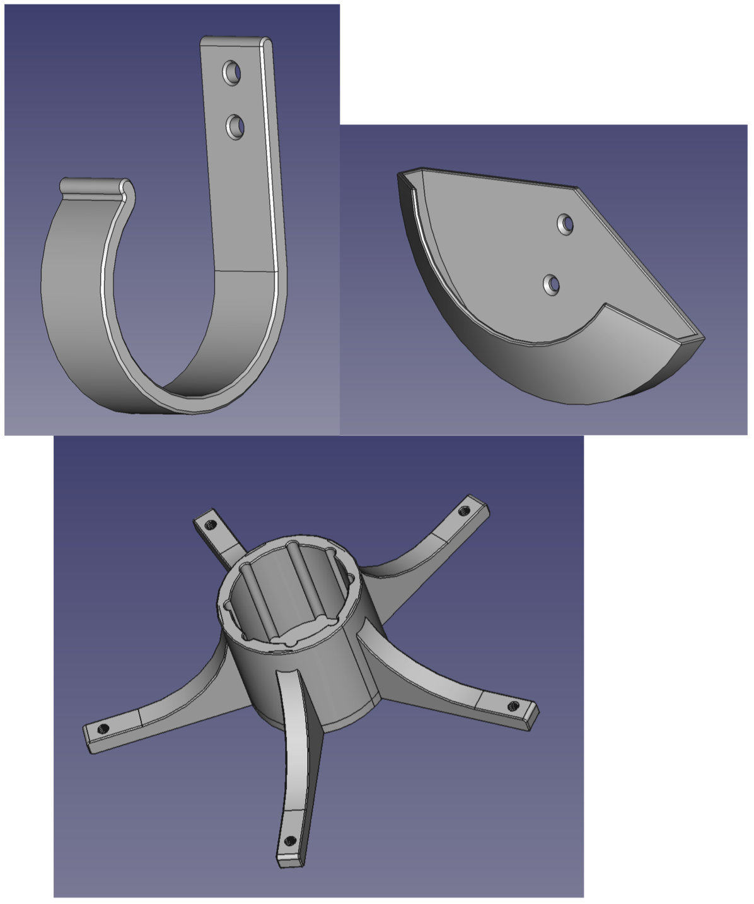
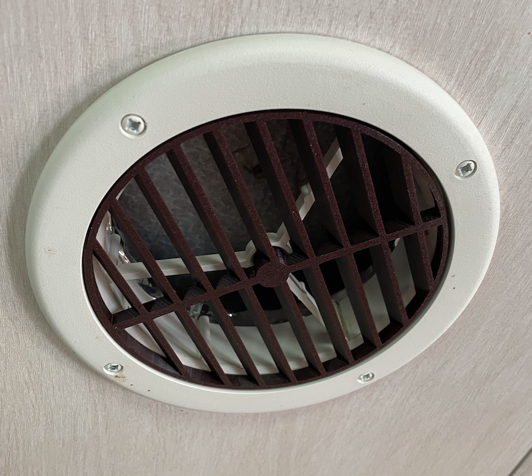
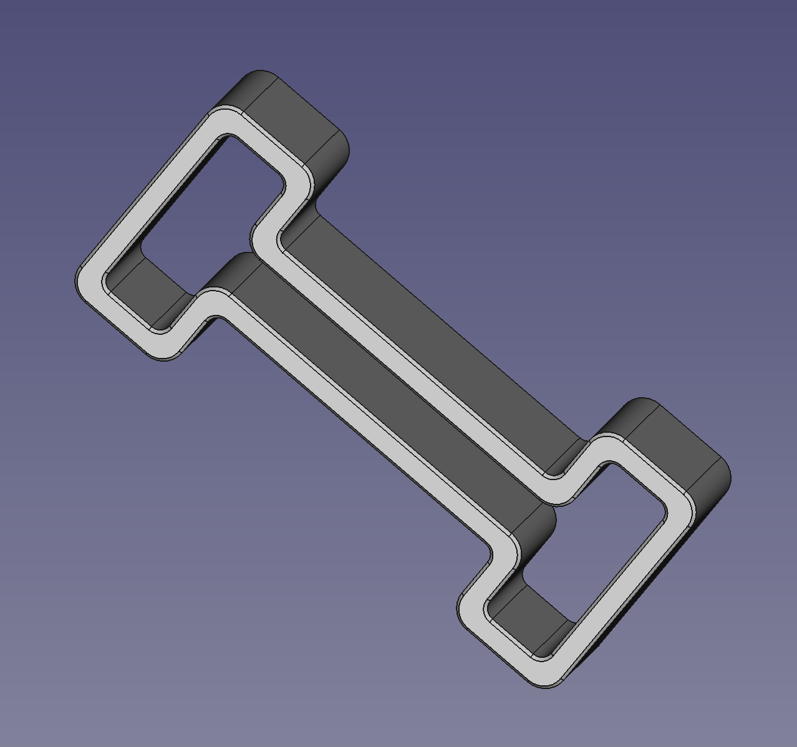
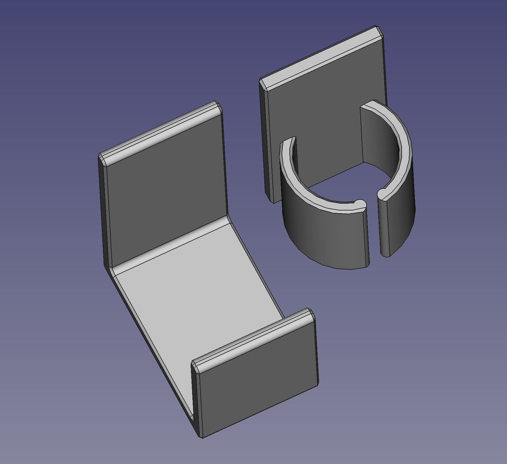
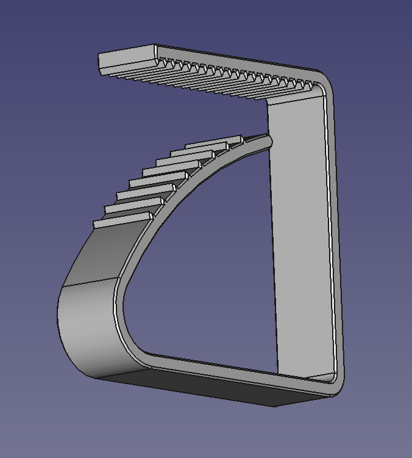
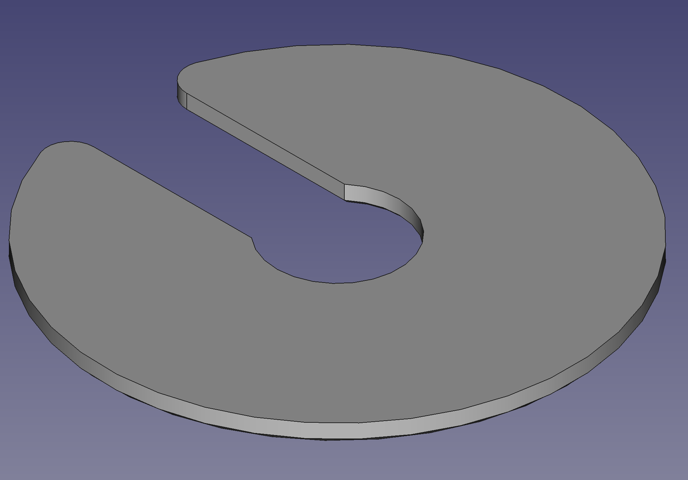

| project | image | info |
| :--- | :---: | :--- |
|[Flagpole Buddy](Flagpole-Buddy)|  | Accessories and storage solutions for Flagpole Buddy.|
|[drawer stop](drawer stop)|  ||
|[Circular AC Vent Cover](Circular-AC-Vent-Cover)|  | This is a design for a circular AC vent cover, replacing the factory vents in our RV. The nominal vent size is 137mm (5-3/8 inches).|
|[rv refer door block](rv-refer-door-block)|  | A small clip to block the doors of an RV refer open when the RV is in storage and the refer is off.|
|[toaster oven](toaster-oven)|  ||
|[battery box](battery box)|  ||
|[cable management](cable-management)|  | A 3M-command strip mountable ring for managing USB etc. cables.|
|[picnic table clips](picnic-table-clips)|  ||
|[rv refer fan cover](rv refer fan cover)|  ||
|[furniture](furniture)|  | Various furniture projects for my RV. Mostly in Sketchup 2017.|
|[laundry bag hook](laundry bag hook)|  ||
|[kitchen island](kitchen island)|  ||
|[rv thermistor clip](rv thermistor clip)|  ||
|[tv lift](tv-lift)|  | A custom TV lift mechanism for my RV. It utilizes a car window winder motor and standard drawer slides to pick up the TV. Its depth is only about 4.5 inches overall, the width is about 4 inches wider than the TV, the height is about 8 inches more than the TV.|
|[drawer dividers](drawer dividers)|  ||
|[cpap hose retainer clip](cpap-hose-retainer-clip)|  | I need a CPAP machine, and I keep mine in the cabinet above the head of my bed in the RV. The hose drops down through a hole drilled in the bottom of the cabinet. This clip keeps the hose at a fixed drop-down length.|
|[funnel](funnel)|  ||
|[cat food storage](cat food storage)|  ||
|[compliant latch](compliant latch)|  ||
|[sonos mount](sonos mount)|  ||
|[wall hangers](wall-hangers)|  ||
