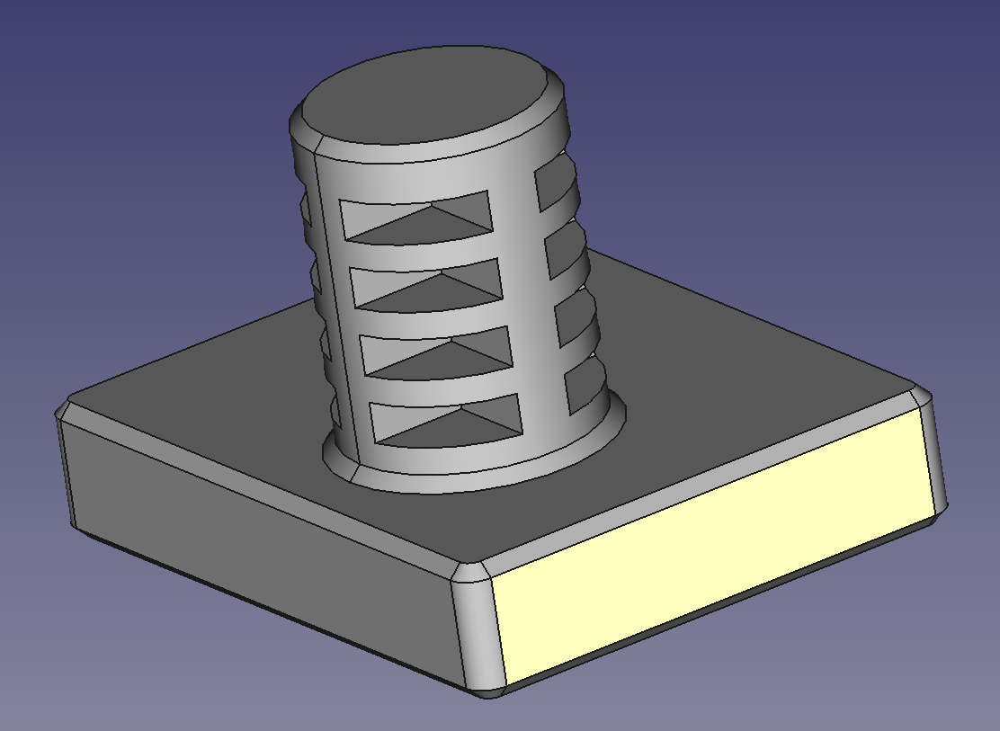
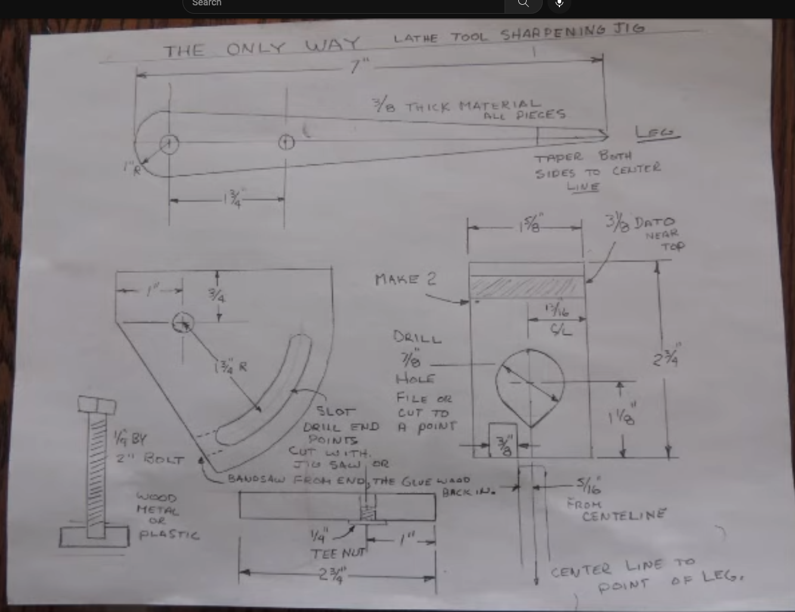
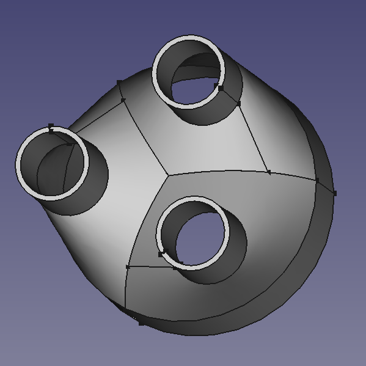
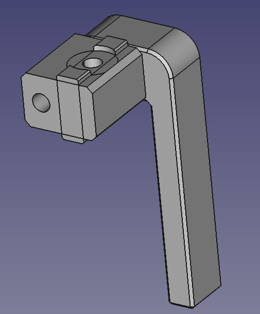

| project | image | info |
| :--- | :---: | :--- |
|[cnc workholding](cnc-workholding)|  | placeholder README.md file for cnc-workholding|
|[veneer spool holder](veneer-spool-holder)|  | placeholder README.md file for veneer-spool-holder|
|[framing square caliper](framing-square-caliper)|  | placeholder README.md file for framing-square-caliper|
|[zip tie mounts](zip-tie-mounts)|  | placeholder README.md file for zip-tie-mounts|
|[drill press table](drill-press-table)|  | placeholder README.md file for drill-press-table|
|[cnc bench dogs](cnc-bench-dogs)|  | placeholder README.md file for cnc-bench-dogs|
|[only way sharpening jig](only-way-sharpening-jig)|  | placeholder README.md file for only-way-sharpening-jig|
|[mac mini vesa mount](mac-mini-vesa-mount)|  | placeholder README.md file for mac-mini-vesa-mount|
|[3d printer exhaust](3d-printer-exhaust)|  | placeholder README.md file for 3d-printer-exhaust|
|[flip stop](flip-stop)|  | placeholder README.md file for flip-stop|
|[dust collection blast gates](dust-collection-blast-gates)|  | placeholder README.md file for dust-collection-blast-gates|
