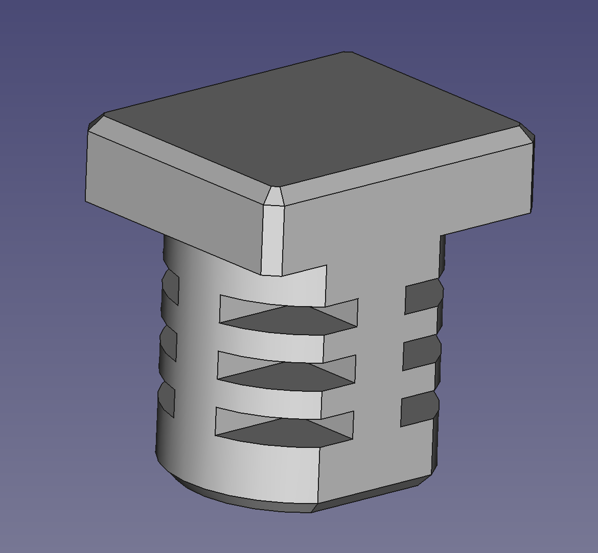

| project | image | info |
| :--- | :---: | :--- |
|cnc-workholding|  | placeholder README.md file for cnc-workholding|
|veneer-spool-holder|  | placeholder README.md file for veneer-spool-holder|
|framing-square-caliper|  | placeholder README.md file for framing-square-caliper|
|zip-tie-mounts|  | placeholder README.md file for zip-tie-mounts|
|drill-press-table|  | placeholder README.md file for drill-press-table|
|cnc-bench-dogs|  | placeholder README.md file for cnc-bench-dogs|
|only-way-sharpening-jig|  | placeholder README.md file for only-way-sharpening-jig|
|mac-mini-vesa-mount|  | placeholder README.md file for mac-mini-vesa-mount|
|3d-printer-exhaust|  | placeholder README.md file for 3d-printer-exhaust|
|flip-stop|  | placeholder README.md file for flip-stop|
|dust-collection-blast-gates|  | placeholder README.md file for dust-collection-blast-gates|
